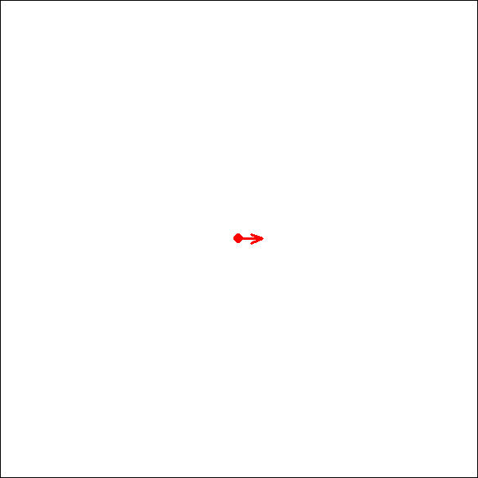
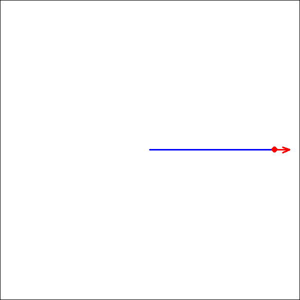
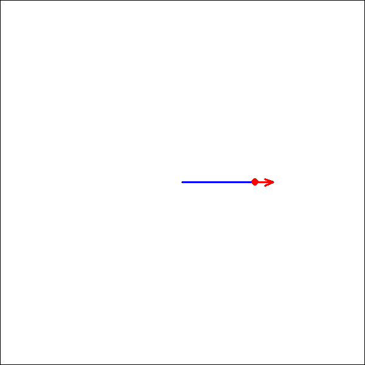

```{r setup, include=FALSE}
knitr::opts_chunk$set(echo = TRUE)
library(tidyverse)
library(magick)
library(here)
```

# Logo

**Goal:** Programming a simple language with R

Logo goes back much earlier than the Apple II, it was developed in 1967 by Cynthia Solomon, Wally Feurzig, and Seymour Papert. That's five years before C and 24 years before Python! The three worked at Bolt, Beranek, and Newman (BBN), famous for all kinds of other computing history. BBN built the first Interface Message Processors (early routers) in 1968 for the ARPANET, which would evolve into the modern internet. [...learn more](https://learn.adafruit.com/program-logo-on-an-apple-ii/what-is-logo)

## Basic Commands

Implementing the basic commands [see "Hello Turtle"](https://learn.adafruit.com/program-logo-on-an-apple-ii/hello-turtle)

### CLEARSCREEN (CS)

Clear the screen and initializing the field

```{r}
CLEARSCREEN <- function (data) {
  data <- new_field(5)
}
```

```{r}
CS <- function (data) {
  CLEARSCREEN(data)
}
```

### HIDETURTLE (HT)

Don't show the turtle cursor.

```{r}
HIDETURTLE <- function (data) {
  data$turtle <- FALSE
  data <- record_path(data, turtle = data$turtle)
  data
}
```

```{r}
HT <- function (data) {
  HIDETURTLE(data)
}
```

### SHOWTURTLE (ST)

Show the turtle cursor.

```{r}
SHOWTURTLE <- function (data) {
  data$turtle <- TRUE
  data <- record_path(data, turtle = data$turtle)
  data
}
```

```{r}
ST <- function (data) {
  SHOWTURTLE(data)
}
```

### FORWARD (FD)

Move forward *steps*.

```{r}
FORWARD <- function (steps, data) {
  angle <- data$path$rad[data$pos] 
  x0 <- data$path$x[data$pos]
  y0 <- data$path$y[data$pos]
  x1 <- x0 + cos(angle) * steps
  y1 <- y0 + sin(angle) * steps
  data <- record_path(data,  x = x1, y = y1, 
                      path_color = data$path_color)
  data
}
```

```{r}
FD <- function (steps, data) {
  FORWARD(steps, data)
}
```

### BACK (BK)

Move back *steps*.

```{r}
BACK <- function (steps, data) {
  FORWARD(-steps, data)
}
```

```{r}
BK <- function (steps, data) {
  BACK(steps, data)
}
```

### LEFT (LT)

Turn left this many degrees. Negative degrees work too, they'll turn it right.

```{r}
LEFT <- function (degs, data) {
  data$heading <- data$heading + degs
  data <- record_path(data, rad = data$heading * pi / 180)
  data
}
```

```{r}
LT <- function (degs, data) {
  LEFT(degs, data)
}
```

### RIGHT (RT)

Turn right this many degrees.

```{r}
RIGHT <- function (degs, data) {
  LEFT(-degs, data)
}
```

```{r}
RT <- function (degs, data) {
  RIGHT(degs, data)
}
```

### SETHEADING (SH)

Turn to an absolute heading of *degrees*.

```{r}
SETHEADING <- function (deg, data) {
  data$heading <- deg
  data <- record_path(data, rad = data$heading * pi / 180)
  data
}
```

```{r}
SH <- function (deg, data) {
  SETHEADING(deg, data)
}
```

### SETPOS (SP)

Set the position to *x, y* coordinates. These are Cartesian, so 0,0 is the middle of the screen.

```{r}
SETPOS <- function (x1, y1, data) {
  data <- record_path(data, x = x1, y = y1, 
                      path_color = "transparent")
  data
}
```

```{r}
SP <- function (x1, y1, data) {
  SETPOS(x1, y1, data)
}
```

### HOME

Move back to the home position.

```{r}
HOME <- function (data) {
  SETPOS(x1 = 0, y1 = 0, data)
}
```

### SETPOSX (SPX)

Set the horizontal position to *x*.

```{r}
SETPOSX <- function (x1, data) {
  SETPOS(x1, y1 = data$path$y[data$pos], data)
}
```

```{r}
SPX <- function (x1, data) {
  SETPOSX(x1, data)
}
```

### SETPOSY (SPY)

Set the vertical position to *y*.

```{r}
SETPOSY <- function (y1, data) {
  SETPOS(x1 = data$path$x[data$pos], y1, data)
}
```

```{r}
SPY <- function (y1, data) {
  SETPOSY(y1, data)
}
```

## Gimmicks

### SETPATHCOLOR (SPC)

```{r}
SETPATHCOLOR <- function (path_color, data) {
  data$path_color <- path_color
  data <- record_path(data, path_color = data$path_color)
  data
}
```

```{r}
SPC <- function (path_color, data) {
  SETPATHCOLOR(path_color, data)
}
```

### SETTURTLECOLOR (STC)

```{r}
SETTURTLECOLOR <- function (turtle_color, data) {
  data$turtle_color <- turtle_color
  data <- record_path(data, turtle_color = data$turtle_color)
  data
}
```

```{r}
STC <- function (turtle_color, data) {
  SETTURTLECOLOR(turtle_color, data)
}
```

### SETNEWCHUNK (SNC)

```{r}
SETNEWCHUNK <- function (data) {
  data$chunk <- data$chunk + 1
  data <- record_path(data)
  data
}
```

```{r}
SNC <- function (data) {
  SETNEWCHUNK(data)
}
```

### UNDOCHUNK (UNDO)

```{r}
UNDOCHUNK <- function (data) {
  last_chunk <- max(data$path$chunk)
  data$path <- data$path[data$path$chunk != last_chunk,]
  
  data$chunk <- max(data$path$chunk)
  data$pos <- nrow(data$path)
  data$heading <- data$path$rad[data$pos] * 180 / pi 
  data$turtle <- data$path$turtle[data$pos]
  data$turtle_color <- data$path$turtle_color[data$pos]
  
  last_pos <- data$pos
  while (data$path$path_color[last_pos] == "transparent" && last_pos > 0) {
    last_pos <- last_pos - 1
  }
  data$path_color <- data$path$path_color[last_pos]
  
  data
}
```

```{r}
UNDO <- function (data) {
  UNDOCHUNK(data)
}
```

### SETSPEED (SPEED)

```{r}
SETSPEED <- function (speed, data) {
  speed <- pmin(pmax(speed, 1), 100)
  speed <- round(speed)
  data$speed <- speed
  data
}
```

```{r}
SPEED <- function (speed, data) {
  SETSPEED(speed, data)
}
```

### REPLOT

```{r}
REPLOT <- function (data, chunk = FALSE) {
  PLOT(data, chunk)
}
```

### SAVEPATH (SAVE)

```{r}
SAVEPATH <- function (name, data) {
  name_raw <- paste0(name, ".rds")
  name_gif <- paste0(name, ".gif")
  saveRDS(data$path, here("LOGO", name_raw))
  file.copy(from = here("LOGO", "temp", "output.gif"), 
            to = here("LOGO", name_gif), 
            overwrite = TRUE)
  data
}
```

```{r}
SAVE <- function (name, data) {
  SAVEPATH(name, data)
}
```

### QUITLOGO (QUIT)

```{r}
QUITLOGO <- function (data) {
  suppressWarnings(unlink(here("LOGO", "temp"), recursive = TRUE))
  data <- NULL
  data
}
```

```{r}
QUIT <- function (data) {
  QUITLOGO(data)
}
```

## Parsing Prompts

### Clean strings

```{r}
clean_prompt <- function (Prompt) {
  Prompt <- gsub("([^a-zA-Z0-9])", " \\1 ", Prompt)
  Prompt <- gsub("\\s+", " ", Prompt)
  Prompt <- gsub("-\\s+(?=\\d)", "-", Prompt, perl = TRUE)
  Prompt <- gsub("\\s*\\.\\s*", ".", Prompt)
  Prompt <- gsub("\\s*_\\s*", "_", Prompt)
  Prompt <- trimws(Prompt)
  Prompt
}
```

### Analyzing and spliting Code

```{r}
breakup_String <- function(String) {
  cl_String <- clean_prompt(String)
  split_String <- strsplit(cl_String, " ")[[1]]
  df <- data.frame(Code = split_String)
  
  n_func <- 0
  df$ID_Func <- rep(0, nrow(df))
  
  n_par <- 0
  df$ID_Par <- rep(0, nrow(df))
  
  ID <- 1
  df$ID_Repeat <- rep(0, nrow(df))
  
  brakets <- data.frame(ID = ID,
                        Status = TRUE,
                        n = 1)
  
  level <- brakets$ID[max(which(brakets$Status == TRUE))]
  
  df$n_Repeat <- rep(1, nrow(df))
  
  is_par_braket <- FALSE
  
  i <- 1
  imax <- nrow(df) + 1
  
  while ( i < imax ) {
    
    if (df$Code[i] == "[") {
        n_par <- n_par + 1
        is_par_braket <- TRUE
        i <- i + 1
        next
    }
    
    if (is_par_braket) {
      
      if (df$Code[i] == "]") {
        is_par_braket <- FALSE
        i <- i + 1
        next
      }
      
      if ( !grepl("[A-Za-z]", df$Code[i])) {
        df$ID_Func[i] <- n_func
        df$ID_Par[i] <- n_par
        df$ID_Repeat[i] <- brakets$ID[brakets$ID == level]
        df$n_Repeat[i] <- brakets$n[brakets$ID == level]
        i <- i + 1
        next
      } else {
        inLower <- tolower(df$Code[i])
        if (inLower == "n") {
          df$Code[i] <- paste0("(",inLower,")")
        } else if (inLower %in% colors()) {
          df$Code[i] <- paste0(shQuote(inLower))
        } else if (exists(inLower)) {
          df$Code[i] <- inLower
        }  else {
          df$Code[i] <- paste0(shQuote(df$Code[i]))
        }
        df$ID_Func[i] <- n_func
        df$ID_Par[i] <- n_par
        df$ID_Repeat[i] <- brakets$ID[brakets$ID == level]
        df$n_Repeat[i] <- brakets$n[brakets$ID == level]
        i <- i + 1
        next
      }
      
    } else {
      
      if (df$Code[i] == "]") {
      brakets$Status[brakets$ID == level] <- FALSE
      level <- brakets$ID[max(which(brakets$Status == TRUE))]
      i <- i + 1
      next
      }
      
      if ( !grepl("[A-Za-z]", df$Code[i]) ) {
        n_par <- n_par + 1
        df$ID_Func[i] <- n_func
        df$ID_Par[i] <- n_par
        df$ID_Repeat[i] <- brakets$ID[brakets$ID == level]
        df$n_Repeat[i] <- brakets$n[brakets$ID == level]
        i <- i + 1
        next
      } else {
        inCaps <- toupper(df$Code[i])
        
        is_LOGO_func <- exists(inCaps) && is.function(get(inCaps))
        if (is_LOGO_func) {
          n_func <- n_func + 1
          df$Code[i] <- inCaps
        }
      
        is_repeat <- inCaps == "REPEAT"
        if (is_repeat) {
          n_func <- n_func + 1
          ID <- ID + 1
          i = i + 2
          df$Code[i] <- inCaps
          brakets <- rbind(brakets,
                           data.frame(ID = ID, 
                                      Status = TRUE, 
                                      n = round(as.numeric(df$Code[i - 1]))))
          level <- brakets$ID[max(which(brakets$Status == TRUE))]
        }
        df$ID_Func[i] <- n_func
        df$ID_Repeat[i] <- brakets$ID[brakets$ID == level]
        df$n_Repeat[i] <- brakets$n[brakets$ID == level]
        i <- i + 1
        next
      }
    }

  }
  return(df[df$ID_Func != 0,])
}
```

```{r}
CodeLine <- "save [logo. 10]SP [-pi/5] [- PI / 6] REPeAT 2[FD [-n + Pi grEen] RT 18] fd 2"
cl_splited <-breakup_String(CodeLine)
cl_splited
```

### Create Calls

```{r}
create_Calls <- function (splited) {
  Calls <- splited %>%
    group_by(ID_Func, ID_Par) %>%
    mutate(Func_Par = ifelse(ID_Par > 0,1,0),
           Code = ifelse(first(ID_Par) > 0, 
                         paste0(Code, collapse = ""),
                         Code)) %>%
    ungroup() %>%
    distinct(Code, ID_Func, ID_Par, Func_Par, .keep_all = TRUE) %>%
    
    group_by(ID_Func, Func_Par) %>%
    mutate(Code = ifelse(first(Func_Par) > 0, 
                         paste0(c(Code,"data)"), collapse = ","), 
                         Code)) %>%
    ungroup() %>%
    distinct(Code, ID_Func, Func_Par, .keep_all = TRUE) %>%
  
    group_by(ID_Func) %>%
    mutate(Code = ifelse(n() > 1,
                         paste0(Code, collapse = "("),
                         paste0(Code, "(data)"))) %>%
    ungroup() %>%
    rename(Call = Code, ID = ID_Repeat, n = n_Repeat ) %>%
    select(Call,ID, n)%>%
    distinct(Call,ID, n, .keep_all = TRUE)
  
  if ( nrow(Calls) > 1 ) {
      first_call <- data.frame(Call = "SETNEWCHUNK(data)", ID = 1, n = 1)
      last_call <- data.frame(Call = "PLOT(data)", ID = 1, n = 1)
      Calls <- rbind(first_call, Calls, last_call)
  } else {
    if ( any(grepl("^UN|SPEED|SAVE", Calls$Call)) ) {
      last_call <- data.frame(Call = "REPLOT(data)", ID = 1, n = 1)
      Calls <- rbind(Calls, last_call)
    } else if ( !any(grepl("QUIT", Calls$Call)) ) {
      last_call <- data.frame(Call = "PLOT(data)", ID = 1, n = 1)
      Calls <- rbind(Calls, last_call)
    } else {
      
    }
  }
  Calls
}
```

```{r}
Callshort <- create_Calls(cl_splited)
Callshort 
```

### Expand Repeats

```{r}

expand_Repeats <- function (Calls) {
  IDmax <- max(Calls$ID)
  if (IDmax == 1) {
    return(as.vector(Calls$Call))
  } 
  while (IDmax > 1){
    
    dfm <- data.frame(
      Call = character(),
      ID = integer(),
      n = integer(),
      stringsAsFactors = FALSE
      )
    
    rID <- range(which(Calls$ID == IDmax))
    n <- Calls$n[rID[1]] 
    middle <- (rID[1] + 1):rID[2]
    
    for (i in 1:n) {
      dfm_sub <- Calls[middle, ] %>%
        mutate(Call = gsub("\\(n\\)", i, Call))
      dfm <- rbind(dfm,dfm_sub)
      }
    dfm$ID <- Calls$ID[rID[1]-1]
    dfm$n <- Calls$n[rID[1]-1]
    
    before <- 1:(rID[1] - 1)
    dfb <- Calls[before, ]
    
    after <- (rID[2] + 1):nrow(Calls)
    dfa <- Calls[after, ]
    
    Calls <- rbind(dfb,dfm,dfa)
    IDmax <- max(Calls$ID)
  }
  return(as.vector(Calls$Call[Calls$Call != ""]))
}
```

```{r}
Calls <- expand_Repeats(Callshort)
Calls
```

### Run Calls

```{r}
run_prompt <- function (Prompt, data) {
  Prompt_splited <- breakup_String(Prompt)
  Callshort <- create_Calls(Prompt_splited)
  Calls <- expand_Repeats(Callshort)
  for (i in 1:length(Calls)){
    data <- eval(parse(text = as.character(Calls[i])))
    }
  data
}
```

## Helper Functions

### New field

Initializing the game

```{r}
new_field <- function (size) {
  dir_path <- here("LOGO","temp")
  chunk <- 1
  pos <- 1
  heading <- 0
  turtle <- TRUE
  turtle_color <- "red"
  path_color <- "blue"
  speed <- 50
  path <- data.frame(chunk = 1,
                     x = 0, y = 0, rad = 0, 
                     path_color = path_color,
                     turtle = turtle,
                     turtle_color = turtle_color)
  field <- NULL
  data <- list(field_name = "Logo",
               field_dir = file.path(dir_path),
               size = abs(size),
               chunk = chunk,
               pos = pos,
               heading = heading,
               turtle = turtle,
               turtle_color = turtle_color,
               path_color = path_color,
               speed = speed,
               path = path)
  data
}
```

### Record Path

```{r}
 record_path <- function (data, 
                          x = NULL, 
                          y = NULL, 
                          rad = NULL, 
                          path_color = NULL, 
                          turtle = NULL,
                          turtle_color = NULL) {
  newrow <- data$path[data$pos,]
  newrow$chunk <- data$chunk
  if(!is.null(x)) newrow$x <- x
  if(!is.null(y)) newrow$y <- y
  if(!is.null(rad)) newrow$rad <- rad
  if(!is.null(path_color)) newrow$path_color <- path_color
  if(!is.null(turtle)) newrow$turtle <- turtle
  if(!is.null(turtle_color)) newrow$turtle_color <- turtle_color
  data$pos <- data$pos + 1
  data$path[data$pos,] <- newrow
  data
}

```

## Plot Functions

### Field

```{r}
plot_field <- function (data, stat = NULL) {
  if(is.null(stat)) stat <- nrow(data$path)
  maxpath <- ceiling(max(abs(data$path[1:stat,c("x","y")])) * 1.05)
  data$size <- max(c(data$size, maxpath))
  png_name <- here(data$field_dir, paste0(data$field_name, stat, ".png"))
  png(png_name, width = 600, height = 600, res = 150)
  par(mar = c(0, 0, 0, 0),
      xaxs = "i", yaxs = "i")
  plot.new()
  plot.window(xlim = c(-data$size, data$size),
              ylim = c(-data$size, data$size),
              asp = 1)
  box()
  data
}
```

### Path

```{r}
plot_path <- function (data, stat = NULL) {
  if(is.null(stat)) stat <- nrow(data$path)
  if (stat > 1) {
     for (i in 2:stat) {
       segments(x0 = data$path$x[i-1], y0 = data$path$y[i-1],
                x1 = data$path$x[i], y1 = data$path$y[i],
                col = data$path$path_color[i], lwd = 2)
     }
  }
  data
}
```

### Turtle

```{r}
plot_turtle <- function (data, stat = NULL) {
  if(is.null(stat)) stat <- nrow(data$path)
  show <-  data$path$turtle[stat]
  if (show) {
    symbols(x = data$path$x[stat],
        y = data$path$y[stat],
        circles = 0.02 * data$size,
        inches = FALSE,
        fg = NA,
        bg = data$path$turtle_color[stat],
        add = TRUE)
    arrow_length <- 0.1 * data$size
    angle <- data$path$rad[stat]
    arrows(data$path$x[stat],
           data$path$y[stat],
           data$path$x[stat] + cos(angle) * arrow_length,
           data$path$y[stat] + sin(angle) * arrow_length,
           col = data$path$turtle_color[stat],
           code = 2,
           length = 0.1,
           angle = 20,
           lwd = 2)
  }
  dev.off()
  data
}
```

### Stat

```{r}
plot_stat <- function (data, stat = NULL) {
  if(is.null(stat)) stat <- nrow(data$path)
  data <- plot_field(data, stat)
  data <- plot_path(data, stat)
  data <- plot_turtle(data, stat)
}
```

### PLOT (Animation)

```{r}
clear_png <- function (data) {
  png_files <- list.files(path = data$field_dir, 
                          pattern = "\\.png$", 
                          full.names = TRUE)
  file.remove(png_files)
}
```

```{r}
save_png <- function (data, chunk) {
  if (chunk) {
    Range <- range(which(data$path$chunk == max(data$chunk)))
    rmin <- max(2,Range[1])
    rmax <- Range[2]
    } else {
      rmin <- 2
      rmax <- nrow(data$path)
    }
  
  Seq0 <- seq(from = 0, to = 1, by = data$speed/5000)
  plot_seq <- qbeta(Seq0, shape1 = 0.15, shape2 = 0.15)
  plot_seq <- (rmax - rmin) * plot_seq + rmin
  plot_seq <- round(plot_seq)
  plot_seq <- unique(plot_seq)

  for (i in plot_seq) {
      plot_stat(data, stat = i)
  }
}
```

```{r}
PLOT <- function (data, chunk = TRUE) {
  clear_png(data)
  save_png(data, chunk = chunk)
  png_files <- list.files(path = data$field_dir, 
                          pattern = "\\.png$", 
                          full.names = TRUE)
  png_files <- png_files[order(as.numeric(gsub("\\D", "", png_files)))]
  img_list <- lapply(png_files, image_read) 
  animation <- image_animate(image_join(img_list), 
                             fps = 10, , loop = 1,
                             optimize = TRUE) 
  image_write(animation, here("LOGO","temp","Output.gif"))
  clear_png(data)
  data
}
```

## Application

```{r}
run_LOGO <- function (string) {
  file_path <- here("LOGO","temp","Logo.rds")
  if (!dir.exists(here("LOGO","temp"))) {
    dir.create(here("LOGO", "temp"), showWarnings = FALSE)
    }
  if (file.exists(file_path)) {
    data <- readRDS(file_path)
    } else {
      data <- new_field(5)
    }
  data <- run_prompt(string, data)
  if (!is.null(data)) {
    saveRDS(data, file_path)
  }
}
```

# Run Game

## Example from the homepage

```{r}
run_LOGO("CS  sPc [black] SP [-pi/5] [-Sin(PI/2)/2]")
run_LOGO("REPEAT 20 [RepeaT 180 [FD 1 RT 2] RT 18]")
run_LOGO("Home SpC [gREEN] StC [blue]")
run_LOGO("REPEaT 20.1 [rEPEAT 180 [fD 1 RT 2] RT 18]")
run_LOGO("UndoChunk")
run_LOGO("SpC [blue] StC [green]")
run_LOGO("REPEaT 5 [rEPEAT 360 [fD 0.5 RT 1] RT 72]")
run_LOGO("SPEED 100")
run_LOGO("SpC [green] StC [red] rt 18")
run_LOGO("REPEaT 5 [rEPEAT 360 [fD 0.5 RT 1] RT 72]")
run_LOGO("SpC [yellow] rt 18")
run_LOGO("REPEaT 5 [rEPEAT 360 [fD 0.5 RT 1] RT 72]")
run_LOGO("SpC [red] rt 18 ht")
run_LOGO("REPEaT 5 [rEPEAT 360 [fD 0.5 RT 1] RT 72]")
```

## Working Output


## Saved Output

```{r}
run_LOGO("SPEED 10 saVe [Logo01]")
```



# Other Exercises

<https://softwareprogramming4kids.com/loops-in-logo/>

```{r}
run_LOGO("CS REPEAT 200 [FD [N*4] RT 90]")
run_LOGO("SPEED 1 saVe [Logo02]")
```


```{r}
run_LOGO("CS REPEAT 80[ FD [n * 5]  RIGHT 144 ]")
run_LOGO("SPEED 1 saVe [Logo03]")
```



```{r}
run_LOGO("CS REPEAT 500 [ FD [n * 2]  RT 89 ]")
run_LOGO("SPEED 1 saVe [Logo04]")
```



```{r}
run_LOGO("QUIT")
```
